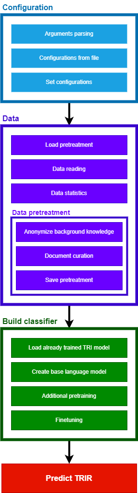

# Text Re-Identification
This repository contains the code and data for the **text re-identification attack** (TRIR) for anonymized documents and subsequent **re-identification risk metric** (TRIR) presented in *B. Manzanares-Salor, D. Sánchez, P. Lison, Evaluating the disclosure risk of anonymized documents via a machine learning-based re-identification attack, Submitted, (2024)*. A first version of this project was presented in [B. Manzanares-Salor, D. Sánchez, P. Lison, Automatic Evaluation of Disclosure Risks of Text Anonymization Methods, Privacy in Statistical Databases, (2022)](https://link.springer.com/chapter/10.1007/978-3-031-13945-1_12).

Data used for the experiments was extracted from the [automatic_text_anonymization](https://github.com/fadiabdulf/automatic_text_anonymization) repository, corresponding to the publication [F. Hassan, D. Sanchez, J. Domingo-Ferrer, Utility-Preserving Privacy Protection of Textual Documents via Word Embeddings, IEEE Transactions on Knowledge and Data Engineering, (2021)](https://ieeexplore.ieee.org/abstract/document/9419784).

## Table of Contents
* [Project structure](#project-structure)
* [Code structure](#code-structure)
* [Install](#install)
* [Usage](#usage)
  * [Configuration](#configuration)
  * [Results](#results)
  * [Examples](#examples)

# Project structure
```
Text Re-Identification
│   README.md                               # This README
│   TRI.py                                  # Simple Command Line Interface Python program for Text Re-Identification
│   functions.py                            # Auxiliar code file for classes and functions. Used by TRI_CLI.py
│   install_requirements.sh                 # Bash script for installing the required Python packages (with specific versions) using Conda
│   install_requirements.bat                # Windows version of the previous script
|   code_structure.png                      # Diagram used later in this README
└───examples                                # Folder with examples
    │   config.json                         # Example configuration
    │   WikiActors_50_eval.json             # Dataset with 50 protected individuals and background knowledge for the same 50
    │   WikiActors_50_eval_25%BK.json       # Same as previous dataset but with only the first 25% of each background knowledge document
    │   WikiActors_500_random.json          # Dataset with 50 protected individuals and background knowledge for ∼500 individuals, including the 50
    │   WikiActors_500_random_25%BK.json    # Same as previous dataset but with only the first 25% of each background knowledge document
    │   WikiActors_500_filtered.json        # Dataset with 50 protected individuals and background knowledge for ∼500 individuals, including only 40 of the 50 
    │   WikiActors_500_filtered_25%BK.json  # Same as previous dataset but with only the first 25% of each background knowledge document
    │   WikiActors_2000_filtered.json       # Dataset with 50 protected individuals and background knowledge for ∼2000 individuals, including only 42 of the 50
    │   WikiActors_2000_filtered_25%BK.json # Same as previous dataset but with only the first 25% of each background knowledge document
```

# Code structure
To facilitate the understanding of our implementation, the code in both [TRI.py](TRI.py) and [functions.py](functions.py) scripts is structured into four main blocks, depicted in the following diagram. If using [Visual Studio Code IDE](https://code.visualstudio.com/), it is recommended to install the *Python Code Tools* extension for collapsing and extending the corresponding code regions. During the execution of [TRI.py](TRI.py), multiple prints indicate the current section within this structure.

<p align="center">
  
</p>

# Install
Our implementation uses Python 3.9 as programming language and [Conda](https://docs.conda.io/projects/conda/en/latest/) 24.1.2 for packages installation. The [install_requirements.sh](install_requirements.sh) (for Linux) and [install_requirements.bat](install_requirements.bat) (for Windows) scripts facilitate the creation of a Conda environment and installation of the exact Python packages we leveraged.

For Linux:
```bash
./install_requirements.sh
```

For Windows (tested with Windows 11):
```console
./install_requirements.bat
```

# Usage
To run TRIA and TRIR, you need to execute the [TRI.py](TRI.py) script, passing as argument the path to a JSON configuration file. The available options for this JSON configuration file are explained in the [Configuration subsection](#configuration). Details on the outputs of the execution are provided in the [Results subsection](#results). In the [Examples subsection](#examples) we illustrate how to run experiments.

For using the configuration file [examples/config.json](examples/config.json), run the following command:
```console
python TRI.py examples/config.json
```

## Configuration
In the following, we specify the configurations available for our implementation, done using a JSON file (example in [examples/config.json](examples/config.json)). For each paramter, we specify the name, type, if it is mandatory or has a default value (i.e., optional) and describe its usage. They are organized accoding to the [code structure](#code-structure).

### Data
* **Load pretreatment**:
  * **LOAD_SAVED_PRETREATMENT | Boolean | Default=true**: If the `Pretreated_Data.json` file exists in the OUTPUT_FOLDER, load that data instead of running the pretreatment. Disable it if you modified the DATA_FILEPATH. It requires a previous execution with `SAVE_PRETREATMENT=true`.
* **Data reading**:
  * **OUTPUT_FOLDERPATH | String | MANDATORY**: Determines the folder were results (see [Results subsection](#results) for details) will be stored. The folder will be created if it does not exist.
  * **DATA_FILEPATH | String | MANDATORY**: Path to the data file to use. That file is expected to define a Pandas dataframe stored in JSON or CSV format containing three types of columns: 
    * *Individual name*: One column with the names of all the individuals. Column named as defined in the `INDIVIDUAL_NAME_COLUMN` parameter. In the nomenclature of our method, this column allows to define both $A_I$ and $B_I$ (explained below).
    * *Background knowledge*: One column with the background knowledge (i.e., public document) available for each individual. Column named as defined in the `BACKGROUND_KNOWLEDGE_COLUMN` parameter. This will be used for training the re-identification attack. If a cell of this column is empty (e.g., `""`, `NaN`, `None` or `null`) it is considered that no background knowledge is available for the individual. In the nomenclature of our method, this column determines $B_D$, and all the individuals in the individual name column that have background knowledge define $B_I$.
    * *Anonymized documents*: At least one column with anonymized text corresponding to the individual. Each column represents the output of an anonymization method for a document related with the individual. The re-identification risk will be computed for each anonymizaiton methods so, since all of them are applied to the same documents, it allows to compare the privacy protection provided by the approaches. No empty cells should be present for these kind of columns. In the nomenclature of our method, this column determines $A_D$, and all the individuals in the individual name column with anonymized document define $A_I$.

    WARNING: A column for indexes (default when exporting from Pandas to CSV) will make the program fail, creating an "Unnamed" anonymized documents set containing numbers.  
    Example of a dataframe with **three** individuals, each of them with background knowledge (except the last) and a document protected with **two** different anonymized methods (Method1 and Method2):

    | name            | public_knowledge                                 | Method1                                                  | Method2                                            |
    |-----------------|--------------------------------------------------|------------------------------------------------------------------------|------------------------------------------------------------------|
    | Joe Bean      | Popular tweet: I built my own fortune!           | Bean received funding from his family to found ORG. | PERSON received funding from DEM to found  UnderPants.      |
    | Ebenezer Lawson | Evebezer Lawson is a popular writer from Kansas. | PERSON, born in LOCATION, has written multiple best-sellers.            | Lawson, born in Kansas, has MISC multiple MISC.                   |
    | Ferris Knight   | NaN                                              | After a long race, PERSON managed to obtain the first position.        | After a EVENT, PERSON managed to obtain the first position. |

    Since no public knowledge has been provided for Ferris Knight, the TRI model will not have samples of her in the training set. Subsequently, it is expected to fail the re-identification of her anonymized texts, limiting the re-identification risk for Method1 and Method2 to 66.666%.

  * **INDIVIDUAL_NAME_COLUMN | String | MANDATORY**: Name of the dataframe column corresponding to the individual or organizaiton name. In the previous example, it will be `name`.
  * **BACKGROUND_KNOWLEDGE_COLUMN | String | MANDATORY**: Name of the column corresponding to the backgorund knowledge document for each individual. In the previous example, it will be `public_knowledge`. The rest of columns not named as defined in `INDIVIDUAL_NAME_COLUMN` or `BACKGROUND_KNOWLEDGE_COLUMN` will be considered as texts anonymized with different methods (one method per column) for evaluating the re-identification risk.

* **Data pretreatment**:
  * **Anonymized background knowledge**:
    * **ANONIMIZE_BACKGROUND_KNOWLEDGE | Boolean | Default=true**: If during document pretreatment generate an anonymized version of the background knowledge documents using [spaCy NER](https://spacy.io/api/entityrecognizer) that would be used along with the non-anonymized version. Its use is strongly recommended, since it can significantly improve re-identification risks. As a counterpoint, it roughly duplicates the training samples, incrementing the training time and RAM consumsumption.
    * **ONLY_USE_ANONYMIZED_BACKGROUND_KNOWLEDGE | Boolean | Default=alse**: If only using the anonymized version of the background knowledge, instead of concatenating it with the non-anonymized version. This usually results in higher re-identification risks than using only the non-anonymized version, but lower than using both (anonymized and non-anonymized). Created for an ablation study.
  * **Data curation**:
    * **USE_DOCUMENT_CURATION | Boolean | Default=true**: Whether to perform the document curation, consisting of lemmatization and removing of stopwords and special characters. It is inexpensive compared to pretraining or finetuning.
  * **Save pretreatment**:
    * **SAVE_PRETREATMENT | Boolean | Default=true**: Whether to save the data after pretreatment. A JSON file name `Pretreated_Data.json` will be generated and stored in the OUTPUT_FOLDERPATH folder.

### Build classifier
* **Load already trained TRI model**:
  * **LOAD_SAVED_FINETUNING | Boolean | Default=True**: If the `TRI_Pipeline` exists in the `OUTPUT_FOLDERPATH` directory and contains the model file `model.safetensors`, load that already trained TRI model instead of running the additional pretraining and finetuning. It requires a previous execution with `SAVE_FINETUNING=true`.
* **Create base language model**:
  * **BASE_MODEL_NAME | String | Default="distilbert-base-uncased"**: Name of the base language model in the [HuggingFace's Transformers library](https://huggingface.co/docs/transformers/index) to be used for both additional pretraining and finetuning. Current code is designed for versions of BERT, DistilBERT and RoBERTa. Examples: "distilbert-base-uncased", "distilbert-base-cased", "bert-base-uncased", "bert-base-cased" and "roberta-base". The `ini_extended_model` in [functions.py](functions.py) can be easily modified for other models.
  * **TOKENIZATION_BLOCK_SIZE | Integer | Default=250**: Number of data samples tokenized at once with [Transformers' tokenizer](https://huggingface.co/docs/transformers/en/main_classes/tokenizer). This is done for limiting and optimizing RAM usage when processing large datasets. The value of 250 is optimized for 32GB of RAM.
* **Additional pretraining**:
  * **USE_ADDITIONAL_PRETRAINING | Boolean | Default=true**: Whether additional pre-training (i.e. Masked Language Modeling, MLM) is to be performed to the base language model. Its usage is recommended, since it is inexpensive (compared to finetuning) and can improve re-identification risks.
  * **SAVE_ADDITIONAL_PRETRAINING | Boolean | Default=true**: Whether to save the additionally pretrained language model. The model will be saved as a PyTorch model file `Pretrained_Model.pt` in the `OUTPUT_FOLDERPATH`.
  * **LOAD_SAVED_PRETRAINING | Boolean | Default=true**: If `USE_ADDITIONAL_PRETRAINING` is true and the `Pretrained_Model.pt` file exists, loads that additionally pretrained base model instead of running the process. It requires a previous execution with `SAVE_ADDITIONAL_PRETRAINING=true`.
  * **PRETRAINING_EPOCHS | Integer | Default=3**: Number of additional pretraining epochs.
  * **PRETRAINING_BATCH_SIZE | Integer | Default=8**: Size of the batches for additional pretraining.
  * **PRETRAINING_LEARNING_RATE | Float | Default=5e-05**: Learning rate for the [AdamW optimizer](https://huggingface.co/docs/bitsandbytes/main/en/reference/optim/adamw) to use during additional pretraining.
  * **PRETRAINING_MLM_PROBABILITY | Float | Default=0.15**: Probability of masking tokens by the [Data Collator](https://huggingface.co/docs/transformers/main_classes/data_collator#transformers.DataCollatorForLanguageModeling.mlm_probability) during the additional pretraining with MLM.
  * **PRETRAINING_SLIDING_WINDOW | String | Default="512-128"**: Sliding window configuration for additional pretraining. Since input documents are assumed to be longer than the maximum number of tokens processable by the language model (maximum sequence length), the text is split into multiple samples. A sliding window mechasim has been implemented, defined by the size of the window and the overlap with the previous window. For example, use "512-128" for samples/splits of 512 tokens and an overlap of 128 tokens with the previous split/sample. Alternatevely, if "No" is used, one sample/split per sentence will be created, leveraging that sentences are generally shorter than the model maximum sequence length. Reducing the window size and/or incrementing the overlap will result in more samples/splits, what increments the training time.
* **Finetuning**:
  * **FINETUNING_EPOCHS | Integer | Default=15**: Number of epochs to perform during the finetuning.
  * **FINETUNING_BATCH_SIZE | Integer | Default=16**: Size of the batches for finetuning.
  * **FINETUNING_LEARNING_RATE | Float | Default=5e-05**: Learning rate for the [AdamW optimizer](https://huggingface.co/docs/bitsandbytes/main/en/reference/optim/adamw) to use during finetuning.
  * **FINETUNING_SLIDING_WINDOW | String | Default="100-25"**: Sliding window configuration for finetuning. Since input documents are assumed to be longer than the maximum number of tokens processable by the language model (maximum sequence length), the text is split into multiple samples. A sliding window mechasim has been implemented, defined by the size of the window and the overlap with the previous window. For example, use "512-128" for samples/splits of 512 tokens and an overlap of 128 tokens with the previous split/sample. Alternatevely, if "No" is used, one sample/split per sentence will be created, leveraging that sentences are generally shorter than the model maximum sequence length. Reducing the window size and/or increasing the overlap will result in more samples/splits, what increments the training time.
  * **SAVE_FINETUNING | Boolean | Default=true**: Whether to save the TRI model after the finetuning. The model will be saved as a [Transformers' pipeline](https://huggingface.co/docs/transformers/main_classes/pipelines), creating a folder `TRI_Pipeline` in the OUTPUT_FOLDERPATH directory, containing the model file `model.safetensors`.

## Results
After execution of [TRI.py](TRI.py), in the `OUTPUT_FOLDERPATH` defined in JSON [configuration file](#configuration) we can find the following files:
* **Pretreated_Data.json**: If `SAVE_PRETREATMENT` is true, this file is created for saving the pretreated backgorund knowledge and protected documents, sometimes referred as training and evaluation data, respectively. Leveraged if `LOAD_SAVED_PRETREATMENT` is true.
* **Pretrained_Model.pt**: If `SAVE_ADDITIONAL_PRETRAINING` is true, this file is created for saving the additionally pretrained language model. Leveraged if `LOAD_SAVED_PRETRAINING` is true.
* **TRI_Pipeline**: If `SAVE_FINETUNING` is true, this folder is created for saving the . Leveraged if `LOAD_SAVED_FINETUNING` is true.
* **Results.csv**: After each epoch of finetuning, the Text Re-Identification Risk (TRIR) resulting from each anonymization method will be evaluated. If using a dataset as the exemplified in the table of the `DATA_FILEPATH` configuration, TRIR results will correspond to Method1 and Method2. These results are stored (always appending, not overwriting) in a CSV file named `Results.csv`. This file contains the epoch time, epoch number and the TRIR for each anonymization method. For example:
  |Time|Epoch                        |Method1|Method2                                |
  |----|-----------------------------|-----------------|---------------------------------------------|
  |28/02/2023 08:50:04|1                            |74.000           |36.000                                       |
  |28/02/2023 08:50:37|2                            |92.000           |44.000                                       |
  |28/02/2023 08:51:10|3                            |94.000           |48.000                                       |

  At the end of the program, TRIR is predicted for all the anonymization methods using the TRI model that obtained the better average TRIR during finetuning (i.e., best epoch). This final evaluation is also stored in the `Results.csv` file as an "additional epoch".

## Examples
In the [examples](examples) folder, a basic JSON configuration file [config.json](examples/config.json) is provided. That configuration uses the [WikiActors_50_eval.json](examples/WikiActors_50_eval.json) dataset, that contains a set of 50 popular actors and actresses born in the 20th century. Background knowledge are the bodies of the actors' Wikipedia articles. Anonymized documents are the abstracts of the actors' Wikipedia articles protected using approaches based on NER, Word2Vec and manual efforts (see [our paper](https://link.springer.com/chapter/10.1007/978-3-031-13945-1_12) for details). Using this [config.json](examples/config.json), the TRIRs expected to be found in the corresponding `Results.csv` of the `OUTPUT_FOLDERPATH` are (may differ by up to 10% depending on execution):
* original_abstract: 100.0%
* ner3_abstract: 70.0%
* ner4_abstract: 60.0%
* ner7_abstract: 88.0%
* presidio_abstract: 74.0%
* spacy_abstract: 70.0%
* word2vec_t=0.5_abstract: 48.0%
* word2vec_t=0.25_abstract: 26.0%
* manual_abstract: 10.0%

Feel free to modify the [config.json](examples/config.json) file for testing with other datasets or configurations. If modifying the `DATA_FILEPATH` setting (i.e., changing the dataset), we recommend to also change the `OUTPUT_FOLDERPATH` directory for avoiding overwritting.