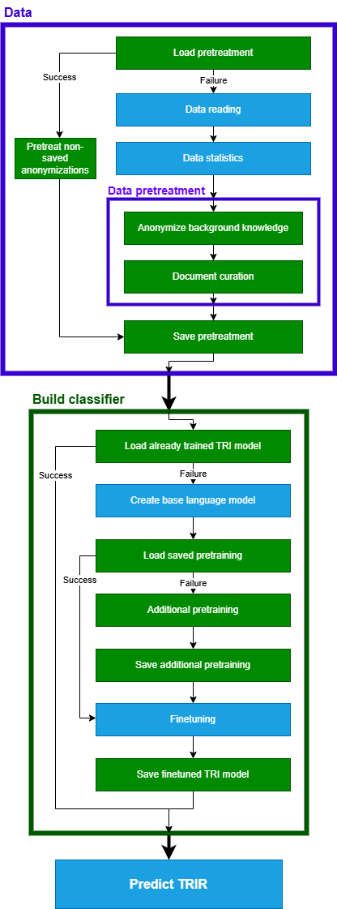

<h1 align="center">Text Re-Identification (TRI)</h1>

<p align="center">
  
  
  
</p>

This repository contains the code and data for the **text re-identification attack** (TRIR) and subsequent **re-identification risk metric** (TRIR) presented in [B. Manzanares-Salor, D. Sánchez, P. Lison, Evaluating the disclosure risk of anonymized documents via a machine learning-based re-identification attack, Data Mining and Knowledge Discovery, 2024](https://doi.org/10.1007/s10618-024-01066-3).
```bibtex
@article{manzanaressalor-etal-tri-2024,
title = {Evaluating the disclosure risk of anonymized documents via a machine learning-based re-identification attack},
journal = {Data Mining and Knowledge Discovery},
ISBN = {1573-756X},
year = {2024},
volume = {(In press)},
author = {Manzanares-Salor, Benet and S\'anchez, David and Lison, Pierre}
}
```
A first version of this project was presented in [B. Manzanares-Salor, D. Sánchez, P. Lison, Automatic Evaluation of Disclosure Risks of Text Anonymization Methods, Privacy in Statistical Databases, 2022](https://doi.org/10.1007/978-3-031-13945-1_12).

Experimental data was extracted from the [automatic_text_anonymization](https://github.com/fadiabdulf/automatic_text_anonymization) repository, corresponding to the publication [F. Hassan, D. Sanchez, J. Domingo-Ferrer, Utility-Preserving Privacy Protection of Textual Documents via Word Embeddings, IEEE Transactions on Knowledge and Data Engineering, 2021](https://ieeexplore.ieee.org/abstract/document/9419784). The exact data files utilized in the experiments are located in the [examples](examples) folder.

## Table of Contents
* [Project structure](#project-structure)
* [Install](#install)
* [Usage](#usage)
  * [CLI](#cli)
  * [TRI class](#tri-class)
* [Configuration](#configuration)
* [Results](#results)
* [Examples](#examples)  
* [TRI workflow](#TRI-workflow)


# Project structure
```
Text Re-Identification (TRI)
│   README.md                               # This README
│   tri.py                                  # Python program including the TRI class, which can be executed as CLI
│   requirements.txt                        # File generated with Conda containing all the required Python packages with specific versions
|   tri_workflow.png                        # Diagram of the TRI class workflow used later in this README
└───examples                                # Folder with examples
    │   config.json                         # Example configuration
    │   WikiActors_50_eval.json             # Panda's dataframe with 50 protected individuals and background knowledge for the same 50
    │   WikiActors_50_eval_25%BK.json       # Same as previous dataframe but with only the first 25% of each background knowledge document
    │   WikiActors_500_random.json          # Panda's dataframe with 50 protected individuals and background knowledge for ∼500 individuals, including the 50
    │   WikiActors_500_random_25%BK.json    # Same as previous dataframe but with only the first 25% of each background knowledge document
    │   WikiActors_500_filtered.json        # Panda's dataframe with 50 protected individuals and background knowledge for ∼500 individuals, including only 40 of the 50 
    │   WikiActors_500_filtered_25%BK.json  # Same as previous dataframe but with only the first 25% of each background knowledge document
    │   WikiActors_2000_filtered.json       # Panda's dataframe with 50 protected individuals and background knowledge for ∼2000 individuals, including only 42 of the 50
    │   WikiActors_2000_filtered_25%BK.json # Same as previous dataframe but with only the first 25% of each background knowledge document
```

# Install
Our implementation uses [Python 3.9.19](https://www.python.org/downloads/release/python-3919/) as programming language and [Conda](https://docs.conda.io/projects/conda/en/latest/) 24.1.2 for package management. All used packages and their respective versions are listed in the [requirements.txt](requirements.txt) file. 

To be able to run the code, follow these steps:
1. Install Conda if you haven't already.
2. Download this repository.
3. Open a terminal in the repository path.
4. Create a new Conda environment using the following command (channels included for ensuring that specific versions can be installed):
```console
conda create --name ENVIRONMENT_NAME --file requirements.txt -c conda-forge -c spacy -c pytorch -c nvidia -c huggingface -c numpy -c pandas
```
5. Activate the just created Conda environment using the following command:
```console
conda activate ENVIRONMENT_NAME
```
Continue with the steps of the [Usage section](#usage).

This has been tested in Windows 10 and Windows 11 operating systems, but should be compatible with Linux-based systems.

# Usage
The TRIA method and TRIR metric are implemented in the [tri.py](tri.py) script. They can be executed via [CLI](#cli) (Command Line Interface) or by importing the [TRI class](#tri-class) directly in your Python code. The following sections provide detailed instructions for both approaches. Additionally, both methods offer extensive configuration options (details on how in each subsection), which are described in the [Configuration section](#configuration).

## CLI
The CLI implementation only requires to pass as argument the path to a JSON configuration file. This file must contain a dictionary with the mandatory configurations, and can also contain optional configurations (see [Configuration section](#configuration)).

For example, for using the configuration file [examples/config.json](examples/config.json), run the following command:
```console
python tri.py examples/config.json
```

## TRI class
You can replicate the CLI behavior in a Python file by importing the `TRI` class from the [tri.py](tri.py) script, instanciating the class and calling to its `run` method. The constructor requires the mandatory configurations as arguments, and also accepts optional configurations (see [Configuration section](#configuration)). Moreover, any of these configurations can be later modified by calling the `set_configs` method. During the execution, multiple loggings indicate the current block within the TRI workflow (see [TRI workflow section](#tri-workflow)). These loggings can be disabled by passing `verbose=False` as argument to the `run` method.

Here is a Python snippet that demonstrates how to run TRI (obtaining TRIR results) for all the data files in the [examples](examples) folder:
```python
import os
from tri import TRI

# Declare TRI mandatory settings (placeholders for output and data paths) and some optional settings
tri = TRI(output_folder_path="To Be Defined",
        data_file_path="To Be Defined",
        individual_name_column="name",
        background_knowledge_column="public_knowledge",
        anonymize_background_knowledge=False,
        use_document_curation=False,
        pretraining_epochs=1,
        finetuning_epochs=1)

# Evaluate all the data files in the "examples" folder
all_results = {}
data_folder_path = "examples"
output_folder_base_path = "outputs"
for data_file_name in os.listdir(data_folder_path):
    # Discard the config.json file
    if data_file_name != "config.json":
        # Set new data_file_path and output_folder_path configurations
        data_file_path = os.path.join(data_folder_path, data_file_name)
        output_name = os.path.splitext(data_file_name)[0] # Filename without extension
        output_folder_path = os.path.join(output_folder_base_path, output_name)
        tri.set_configs(data_file_path=data_file_path,
                        output_folder_path=output_folder_path)
        
        # Run TRIA and get TRIR for each anonymization
        result = tri.run(verbose=True)
        all_results[data_file_name] = {key:value["eval_Accuracy"] for key, value in result.items()}

# Show results for all data files
print(all_results)
```

## Configuration
In the following, we specify the configurations available for our implementation, as [CLI](#cli) (with the JSON file) or as [TRI class](#tri-class) (with the constructor or `set_configs` method). They are generally organized accoding to the [TRI workflow](#tri-workflow). For each configuration, we specify the name, type, if it is mandatory or optional (i.e., has a default value) and description.

### Data
* **Mandatory configurations (generally belonging to Data reading)**:
  * **output_folder_path | String | MANDATORY**: Determines the folder were results will be stored (see [Results section](#results)). The folder will be created if it does not exist.
  * **data_file_path | String | MANDATORY**: Path to the data file to use. That file is expected to define a Pandas dataframe stored in JSON or CSV format containing three types of columns:
    * *Individual name*: One column with the names of all the individuals. Column named as defined in the `individual_name_column` setting. In the nomenclature of our method, this column allows to define both $A_I$ and $B_I$.
    * *Background knowledge*: One column with the background knowledge (i.e., public document) available for each individual. Column named as defined in the `background_knowledge_column` setting. This will be used for training the re-identification attack. If a cell of this column is empty (e.g., `""`, `NaN`, `None` or `null`) it is considered that no background knowledge is available for the individual. In the nomenclature of our method, this column determines $B_D$, and all the individuals in the individual name column that have background knowledge define $B_I$.
    * *Anonymized document set*: At least one column should be anonymized texts corresponding to the individuals. Each column represents the output of an anonymization method for documents related with the individual of the same row. The re-identification risk will be computed for each anonymizaiton methods so, since all of them are applied to the same documents, it allows to compare the privacy protection provided by the approaches. In the nomenclature of our method, this column determines $A_D$, and all the individuals in the individual name column with an anonymized document (instead of being empty) define $A_I$.

    WARNING: A column for indexes (default when exporting from Pandas to CSV) will make the program fail, creating an "Unnamed" anonymized documents set containing numbers.  
    Example of a dataframe with **three** individuals, each of them with background knowledge (except the last) and a document protected with **two** different anonymized methods (Method1 and Method2):

    | name            | public_knowledge                                 | Method1                                                  | Method2                                            |
    |-----------------|--------------------------------------------------|------------------------------------------------------------------------|------------------------------------------------------------------|
    | Joe Bean      | Popular tweet: I built my own fortune!           | Bean received funding from his family to found ORG. | PERSON received funding from DEM to found  UnderPants.      |
    | Ebenezer Lawson | Evebezer Lawson is a popular writer from Kansas. | PERSON, born in LOCATION, has written multiple best-sellers.            | Lawson, born in Kansas, has MISC multiple MISC.                   |
    | Ferris Knight   | NaN                                              | After a long race, PERSON managed to obtain the first position.        | After a EVENT, PERSON managed to obtain the first position. |

    Since no public knowledge has been provided for Ferris Knight, the TRI model will not have samples of her in the training set. Subsequently, it is expected to fail the re-identification of her anonymized texts, limiting the re-identification risk for Method1 and Method2 to 66.66%.

  * **individual_name_column | String | MANDATORY**: Name of the dataframe column corresponding to the individual or organizaiton name. In the previous example, it will be `name`.
  * **background_knowledge_column | String | MANDATORY**: Name of the column corresponding to the background knowledge document for each individual. In the previous example, it will be `public_knowledge`. The rest of columns not named as defined in `individual_name_column` or `background_knowledge_column` will be considered as texts anonymized with different methods (one method per column) for evaluating the re-identification risk.

* **Load pretreatment**:
  * **load_saved_pretreatment | Boolean | Default=true**: If the `Pretreated_Data.json` file exists in the `output_folder_path`, load that data instead of running the pretreatment. Disable it if you completely changed the `data_file_path`. It requires a previous execution with `save_pretreatment=true`.
  * **add_non_saved_anonymizations | Boolean | Default=true**: When loading pretreatment data from `Pretreated_Data.json`, this setting checks whether the file at `data_file_path` includes new anonymizations that need to be processed. If new anonymizations are found, they are loaded and, if `use_document_curation` is true, only these new anonymizations will undergo curation. This option is particularly useful if you have added new anonymizations to the dataframe at `data_file_path` and want to avoid repeating the entire pretreatment.

* **Data pretreatment**:
  * **Anonymized background knowledge**:
    * **ANONIMIZE_BACKGROUND_KNOWLEDGE | Boolean | Default=true**: If during document pretreatment generate an anonymized version of the background knowledge documents using [spaCy NER](https://spacy.io/api/entityrecognizer) that would be used along with the non-anonymized version. Its usage is strongly recommended, since it can significantly improve re-identification risks. As a counterpoint, it roughly duplicates the training samples, incrementing the training time and RAM consumsumption.
    * **only_use_anonymized_background_knowledge | Boolean | Default=alse**: If only using the anonymized version of the background knowledge, instead of concatenating it with the non-anonymized version. This usually results in higher re-identification risks than using only the non-anonymized version, but lower than using both (anonymized and non-anonymized). Created for an ablation study.
  * **Document curation**:
    * **use_document_curation | Boolean | Default=true**: Whether to perform the document curation, consisting of lemmatization and removing of stopwords and special characters. It is inexpensive compared to pretraining or finetuning.

* **Save pretreatment**:
  * **save_pretreatment | Boolean | Default=true**: Whether to save the data after pretreatment. A JSON file name `Pretreated_Data.json` will be generated and stored in the `output_folder_path` folder. As pretreatment it is also included the curation of new anonymizations caused by `updated_loaded_eval_pretreatment=true`.

### Build classifier
* **Load already trained TRI model**:
  * **load_saved_finetuning | Boolean | Default=True**: If the `TRI_Pipeline` exists in the `output_folder_path` directory and contains the model file `model.safetensors`, load that already trained TRI model instead of running the additional pretraining and finetuning. It requires a previous execution with `save_finetuning=true`.
* **Create base language model**:
  * **base_model_name | String | Default="distilbert-base-uncased"**: Name of the base language model in the [HuggingFace's Transformers library](https://huggingface.co/docs/transformers/index) to be used for both additional pretraining and finetuning. Current code is designed for versions of BERT, DistilBERT and RoBERTa. Examples: "distilbert-base-uncased", "distilbert-base-cased", "bert-base-uncased", "bert-base-cased" and "roberta-base". The `ini_extended_model` method from the TRI class (in [tri.py](tri.py)) can be easily modified for other models.
  * **tokenization_block_size | Integer | Default=250**: Number of data samples tokenized at once with [Transformers' tokenizer](https://huggingface.co/docs/transformers/en/main_classes/tokenizer). This is done for limiting and optimizing RAM usage when processing large datasets. The value of 250 is roughly optimized for 32GB of RAM.
* **Additional pretraining**:
  * **use_additional_pretraining | Boolean | Default=true**: Whether additional pre-training (i.e. Masked Language Modeling, MLM) is to be performed to the base language model. Its usage is recommended, since it is inexpensive (compared to finetuning) and can improve re-identification risks.
  * **save_additional_pretraining | Boolean | Default=true**: Whether to save the additionally pretrained language model. The model will be saved as a PyTorch model file `Pretrained_Model.pt` in the `output_folder_path`.
  * **load_saved_pretraining | Boolean | Default=true**: If `use_additional_pretraining` is true and the `Pretrained_Model.pt` file exists, loads that additionally pretrained base model instead of running the process. It requires a previous execution with `save_additional_pretraining=true`.
  * **pretraining_epochs | Integer | Default=3**: Number of additional pretraining epochs.
  * **pretraining_batch_size | Integer | Default=8**: Size of the batches for additional pretraining.
  * **pretraining_learning_rate | Float | Default=5e-05**: Learning rate for the [AdamW optimizer](https://huggingface.co/docs/bitsandbytes/main/en/reference/optim/adamw) to use during additional pretraining.
  * **pretraining_mlm_probability | Float | Default=0.15**: Probability of masking tokens by the [Data Collator](https://huggingface.co/docs/transformers/main_classes/data_collator#transformers.DataCollatorForLanguageModeling.mlm_probability) during the additional pretraining with MLM.
  * **pretraining_sliding_window | String | Default="512-128"**: Sliding window configuration for additional pretraining. Since input documents are assumed to be longer than the maximum number of tokens processable by the language model (maximum sequence length), the text is split into multiple samples. A sliding window mechasim has been implemented, defined by the size of the window and the overlap with the previous window. For example, use "512-128" for samples/splits of 512 tokens and an overlap of 128 tokens with the previous split/sample. Alternatevely, if "No" is used, one sample/split per sentence will be created, leveraging that sentences are generally shorter than the model maximum sequence length. Reducing the window size and/or incrementing the overlap will result in more samples/splits, what increments the training time.
* **Finetuning**:
  * **finetuning_epochs | Integer | Default=15**: Number of epochs to perform during the finetuning.
  * **finetuning_batch_size | Integer | Default=16**: Size of the batches for finetuning.
  * **finetuning_learning_rate | Float | Default=5e-05**: Learning rate for the [AdamW optimizer](https://huggingface.co/docs/bitsandbytes/main/en/reference/optim/adamw) to use during finetuning.
  * **finetuning_sliding_window | String | Default="100-25"**: Sliding window configuration for finetuning. Since input documents are assumed to be longer than the maximum number of tokens processable by the language model (maximum sequence length), the text is split into multiple samples. A sliding window mechasim has been implemented, defined by the size of the window and the overlap with the previous window. For example, use "512-128" for samples/splits of 512 tokens and an overlap of 128 tokens with the previous split/sample. Alternatevely, if "No" is used, one sample/split per sentence will be created, leveraging that sentences are generally shorter than the model maximum sequence length. Reducing the window size and/or increasing the overlap will result in more samples/splits, what increments the training time.
  * **dev_set_column_name | String | Default=false**: Specifies the column name to be used for model selection. If set to `false` (boolean, not string), the model with the highest average accuracy across all anonymization sets will be selected as the final model. If a column name is provided, the accuracy corresponding to that specific anonymization from the dataframe located at `data_file_path` will be used to choose the best model.
  * **save_finetuning | Boolean | Default=true**: Whether to save the TRI model after the finetuning. The model will be saved as a [Transformers' pipeline](https://huggingface.co/docs/transformers/main_classes/pipelines), creating a folder `TRI_Pipeline` in the `output_folder_path` directory, containing the model file `model.safetensors`.

## Results
After execution of TRI (both from CLI or Python code), in the `output_folder_path` you can find the following files:
* **Pretreated_Data.json**: If `save_pretreatment` is true, this file is created for saving the pretreated background knowledge and protected documents, sometimes referred as training and evaluation data, respectively. Leveraged if `load_saved_pretreatment` is true.
* **Pretrained_Model.pt**: If `save_additional_pretraining` is true, this file is created for saving the additionally pretrained language model. Leveraged if `load_saved_pretraining` is true.
* **TRI_Pipeline**: If `save_finetuning` is true, this folder is created for saving the . Leveraged if `load_saved_finetuning` is true.
* **Results.csv**: After each epoch of finetuning, the Text Re-Identification Risk (TRIR) resulting from each anonymization method will be evaluated. These results are stored (always appending, not overwriting) in a CSV file named `Results.csv`. This file contains the epoch time, epoch number, the TRIR for each anonymization method and the average TRIR. for example, if using the dataframe exemplified in the `data_file_path` configuration description, TRIR results will correspond to Method1 and Method2:
  | Time                | Epoch | Method1 | Method2 | Average |
  | ------------------- | ----- | ------- | ------- | ------- |
  | 01/08/2024 08:50:04 | 1     | 74      | 36      | 55      |
  | 01/08/2024 08:50:37 | 2     | 92      | 44      | 68      |
  | 01/08/2024 08:50:10 | 3     | 94      | 48      | 71      |

  At the end of the program, TRIR is predicted for all the anonymization methods using the best TRI model considering the criteria defined for the setting `dev_set_column_name`. This final evaluation is also stored in the `Results.csv` file as an "additional epoch".

## Examples
In the [examples](examples) folder, a basic JSON configuration file [config.json](examples/config.json) and multiple Pandas' dataframes (in JSON format) are provided. That configuration uses the [WikiActors_50_eval.json](examples/WikiActors_50_eval.json) dataframe, that contains a set of 50 popular actors and actresses born in the 20th century. Background knowledge are the bodies of the actors' Wikipedia articles. Anonymized documents are the abstracts of the actors' Wikipedia articles protected using approaches based on NER, Word2Vec and manual efforts; and development set is a random 30\% subset of the spaCy-anonymized abstracts (see [our paper](https://doi.org/10.1007/s10618-024-01066-3) for details). Using this [config.json](examples/config.json) (command example in the [Usage section](#usage)), the final TRIRs expected to be found in the corresponding `Results.csv` of the `output_folder_path` are:
| Method          | TRIR |
|-----------------|------|
| Original        | 100% |
| NER3            | 70%  |
| NER4            | 60%  |
| NER7            | 88%  |
| Presidio        | 74%  |
| spaCy           | 70%  |
| Word2Vec_t=0.5  | 48%  |
| Word2Vec_t=0.25 | 26%  |
| Manual          | 10%  |

*Note that values may differ depending on execution*

Feel free to modify the [config.json](examples/config.json) file for testing other dataframes or configurations. If the `data_file_path` is changed (i.e. if you change the dataframes), we recommend to also change the `output_folder_path` directory to avoid overwriting and/or load pretreated data from other dataframes.

# TRI workflow
To facilitate the understanding of our implementation, the following diagram depicts the workflow of the `TRI` class in [tri.py](tri.py). In is divided into the three main blocks (i.e., Data, Build classifier and Predict TRIR), using <span style="color:blue">blue boxes</span> for the mandatory fragments, and <span style="color:green">green boxes</span> for optional fragments. Depending on the [configuration](#configuration), the optional fragments are executed or it is skipped to the next fragment. If using [Visual Studio Code IDE](https://code.visualstudio.com/), it is recommended to install the *Python Code Tools* extension for collapsing and extending the code regions corresponding to the blocks and boxes.

<p align="center">
  
</p>